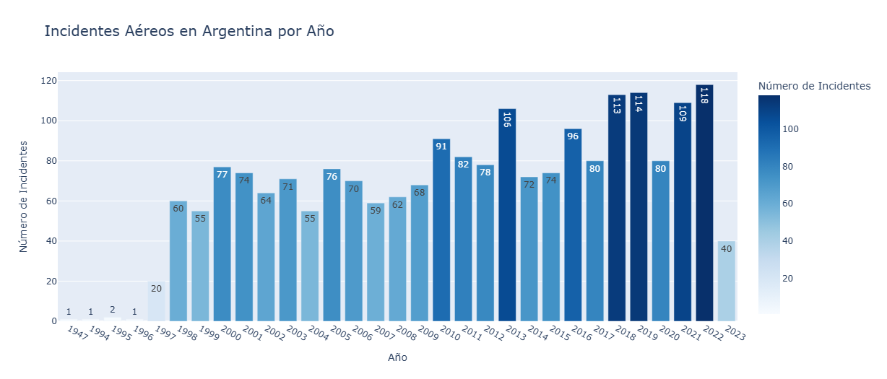
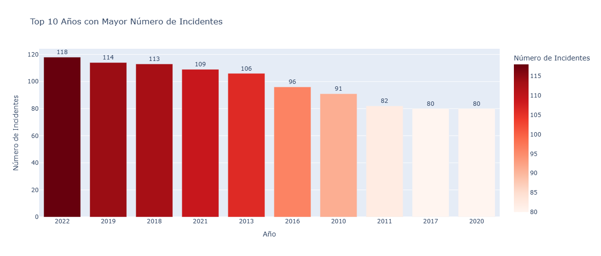
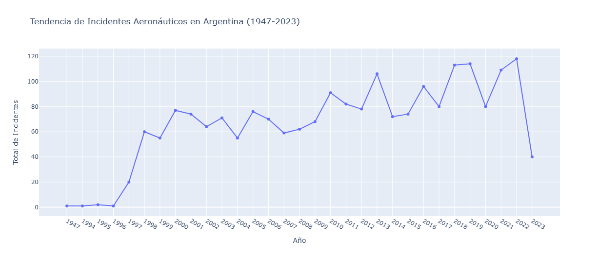
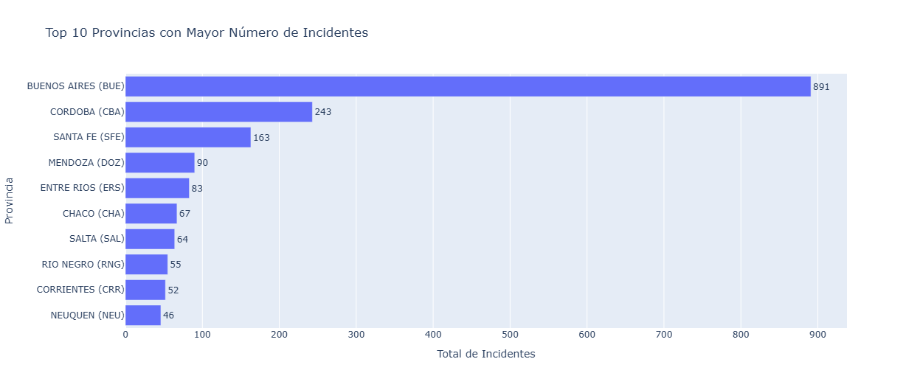
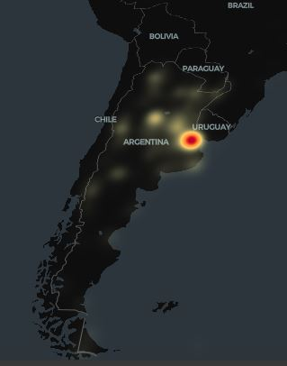
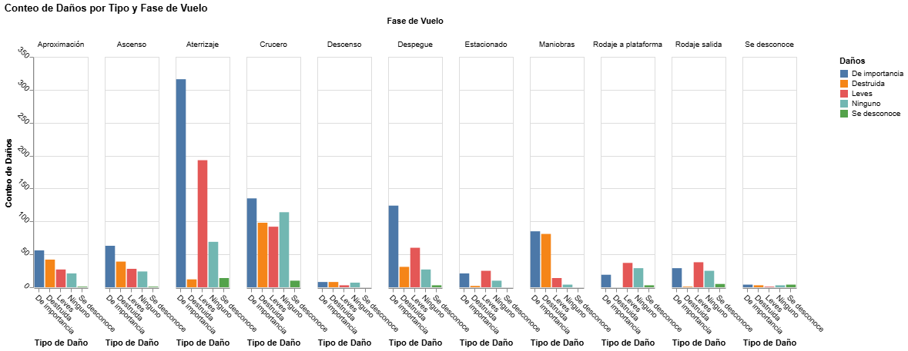
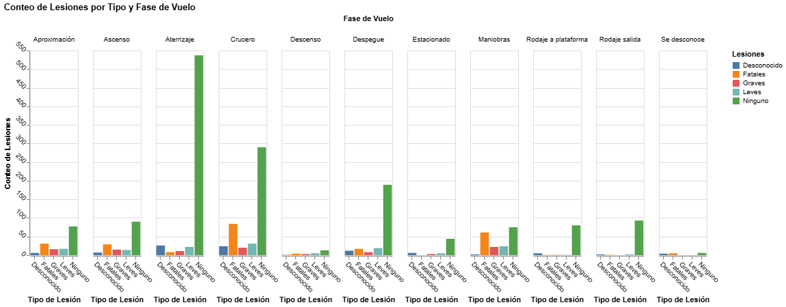
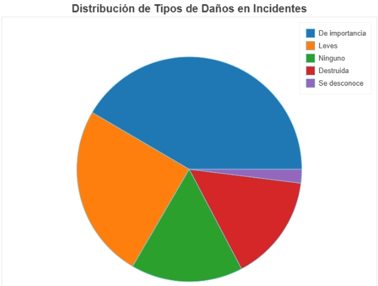

# **Análisis de Incidentes Aeronáuticos en Argentina (1947-2023) ✈️💥**

# **Descripción del Proyecto**
Este proyecto tiene como objetivo descubrir patrones y tendencias en los incidentes aeronáuticos ocurridos en Argentina desde 1947 hasta 2023. A través de un análisis detallado de los datos, se identifican características clave y distribuciones que permiten comprender mejor las causas y circunstancias de estos incidentes. El análisis cubre un periodo de 76 años, proporcionando una visión histórica amplia sobre la evolución de los incidentes aeronáuticos en el país.

Se emplearon técnicas de estadística descriptiva y se crearon visualizaciones interactivas como gráficos de barras, mapas y líneas temporales para facilitar la comprensión de los patrones, así como identificar tendencias y anomalías a lo largo del tiempo. Los factores analizados incluyen la distribución geográfica de los incidentes por provincias, el tipo de daño registrado y la fase del vuelo en la que ocurrieron los incidentes. Estos aspectos son fundamentales para entender las circunstancias en las que se producen los eventos y las áreas más vulnerables del país.

En esta fase exploratoria, se han identificado tendencias en la frecuencia de incidentes en ciertas regiones y en fases específicas del vuelo, lo que proporciona una base para futuros análisis más detallados y medidas preventivas. En una fase posterior, se evaluará la posibilidad de aplicar modelos de aprendizaje automático (machine learning) para predecir incidentes futuros. Basándose en los patrones históricos descubiertos, se podrán entrenar modelos que analicen las variables más significativas y generen predicciones, lo que permitirá mejorar la gestión del riesgo y la prevención de incidentes aéreos en Argentina.

El dataset utilizado para este análisis fue obtenido de Kaggle y se puede acceder a él a través de [click aquí](https://www.kaggle.com/datasets/maifernandarios/sucesos-en-aviacin-argentina).

[Haz clic aquí para acceder al notebook en Google Colab](https://colab.research.google.com/drive/1LbVsiZ4PwS_glYNLxOeNxPwKaRpU36E8?usp=sharing) y visualizar el análisis completo de los incidentes aeronáuticos en Argentina, con gráficos interactivos que incluyen mapas, barras, y líneas temporales.

### Librerías Utilizadas

En este proyecto se emplearon las siguientes librerías de Python para el análisis de datos y la creación de gráficos interactivos:

- **Plotly**: Gráficos interactivos (líneas, barras, mapas).
- **Bokeh**: Gráficos interactivos avanzados.
- **Altair**: Visualizaciones estadísticas.
- **Pydeck**: Mapas interactivos geoespaciales.
- **NumPy**: Operaciones numéricas y manejo de matrices.

Estas librerías fueron utilizadas en el notebook alojado en Google Colab, donde se realizaron visualizaciones avanzadas. 


## **Contenido**
- [Preguntas de Investigación](#preguntas-de-investigación)
- [Instalación de Librerías](#instalación-de-librerías)
- [Carga y Descripción del Dataset](#carga-y-descripción-del-dataset)
- [Verificación de Nulos en el Dataset](#verificación-de-nulos-en-el-dataset)
- [Gráficos Interactivos](#gráficos-interactivos)
- [Conclusiones](#conclusiones)


## **Preguntas de Investigación**
1. **¿Cuál es el año y la década con más incidentes aeronáuticos en Argentina?**
   - *Hipótesis:* Se espera que las décadas más recientes, con mayor tráfico aéreo, presenten un mayor número de incidentes.

2. **¿Cómo han variado los incidentes aeronáuticos a lo largo del tiempo?**
   - *Hipótesis:* Se anticipa una tendencia creciente en los incidentes debido al incremento en vuelos comerciales.

3. **¿Cuáles son las provincias con más incidentes y qué factores pueden influir en su frecuencia?**
   - *Hipótesis:* Las provincias con más actividad aeronáutica deberían mostrar un mayor número de incidentes.

4. **¿Existe alguna relación entre el tipo de fase del vuelo y el tipo de lesiones o daños?**
   - *Hipótesis:* Se prevé que los incidentes más graves estén más relacionados con las fases de aterrizaje y despegue.


## **Instalación de Librerías**
Para ejecutar el análisis en Google Colab, instala las siguientes librerías:

```
!pip install plotly
!pip install bokeh
!pip install altair
!pip install pydeck
```
## **Carga y Descripción del Dataset**
Para comenzar, cargamos el dataset desde Google Drive y mostramos información general sobre su contenido:

```
import pandas as pd

# Ruta del archivo
ruta_archivo = '/content/drive/My Drive/PP1/ProyectoFinal/sucesos-aeronauticos-argentina.csv'
df = pd.read_csv(ruta_archivo)

# Información del DataFrame
print("\nINFORMACIÓN GENERAL DEL DATAFRAME:\n")
df.info()

# Primeras 5 filas del DataFrame
print("\nPRIMERAS 5 FILAS DEL DATAFRAME:\n")
df.head(5)
```

## **Verificación de Nulos en el Dataset**
```
# Verificación de nulos en el DataFrame
nulos = df.isnull().sum()
print("\nNÚMEROS DE VALORES NULOS POR COLUMNA:\n")
print(nulos[nulos > 0])  # Solo mostramos columnas con valores nulos
```


## **Gráficos Interactivos**

Debido a las limitaciones de visualización en GitHub, los gráficos interactivos no pueden ser mostrados directamente aquí. No obstante, se han dejado imágenes estáticas de los gráficos generados para una mejor comprensión de los datos analizados.

Si deseas explorar los gráficos de manera interactiva, puedes acceder al notebook de Google Colab, donde se encuentran disponibles en tiempo real.

[Haz clic aquí para acceder al notebook en Google Colab](https://colab.research.google.com/drive/1LbVsiZ4PwS_glYNLxOeNxPwKaRpU36E8?usp=sharing) y visualizar el análisis completo de los incidentes aeronáuticos en Argentina, con gráficos interactivos que incluyen mapas, barras, y líneas temporales.

### ¿Cuál es el año y la década con más incidentes aeronáuticos en Argentina?
### Distribución de Incidentes por Año

Aquí se presenta la cantidad de incidentes aéreos reportados anualmente. El año 2022 es el que mayor número de incidentes tuvo con 118.
### Distribución de Incidentes por Década

Este gráfico ilustra cómo han variado los incidentes aéreos a lo largo de las décadas. La década de 2000-2010 mostró un notable aumento en incidentes, lo cual podría estar relacionado con el crecimiento del tráfico aéreo durante esa época
### Top 10 Años con Mayor Número de Incidentes

Este gráfico detalla los años en los que se registró el mayor número de incidentes aéreos. El gráfico revela un incremento significativo en los incidentes aéreos en los últimos años, especialmente entre 2018 y 2022, lo que sugiere un posible patrón ascendente. Este aumento podría estar relacionado con factores como mayor tráfico aéreo.

### ¿Cómo han variado los incidentes aeronáuticos a lo largo del tiempo?
### Tendencia de Incidentes en Argentina

Este gráfico muestra la tendencia general de los incidentes aéreos en Argentina a lo largo del tiempo. La tendencia revela fluctuaciones en los incidentes a lo largo del tiempo, con un aumento considerable en los últimos años, alcanzando su pico en 2022. Esto permite observar patrones históricos y posibles periodos de aumento en los incidentes.

### ¿Cuáles son las provincias con más incidentes y qué factores pueden influir en su frecuencia?
### Top 10 Provincias con Mayor Número de Incidentes

Un análisis de las provincias con la mayor cantidad de incidentes aéreos. La provincia de Buenos Aires presenta un número significativamente mayor de incidentes en comparación con las demás, lo cual podría estar relacionado con su densidad poblacional y mayor actividad aérea. Las provincias de Córdoba y Santa Fe también destacan, aunque a menor escala, posiblemente debido a su tráfico aéreo frecuente.
### Mapa Calor de Incidentes


Un mapa de calor que muestra la concentración de incidentes aéreos en diferentes regiones. Como se observa en el mapa, la mayor concentración de incidentes aéreos se registra en la provincia de Buenos Aires, seguida de Córdoba y Santa Fe. Esta tendencia ya fue confirmada en gráficos anteriores sobre la distribución por provincias y ahora se valida mediante las coordenadas de los incidentes. Al ampliar el mapa en la zona de Buenos Aires, se puede notar que la mayor densidad de incidentes se localiza cerca del Aeropuerto de Ezeiza, lo que respalda otros análisis previos que indican que la fase de aterrizaje es crítica en esta área.


### ¿Existe alguna relación entre el tipo de fase del vuelo y el tipo de lesiones o daños?
### Daños por Fase de Vuelo

En el gráfico, se observa que durante la fase de aterrizaje se registran la mayor cantidad de incidentes clasificados como "de importancia", seguidos por aquellos catalogados como "leves". Esto sugiere que la fase de aterrizaje es la que presenta un mayor predominio de incidentes.
### Lesiones por Fase de Vuelo

Este gráfico representa las lesiones registradas durante las diferentes fases de vuelo. En el gráfico, se observa que la fase de aterrizaje presenta la mayor cantidad de incidentes, principalmente con el tipo de lesión categorizada como "ninguno". Le sigue la fase de crucero, que también registra incidentes con lesiones "ninguno", al igual que en la fase de despegue. Sin embargo, en la fase de crucero se destaca un número significativo de incidentes con lesiones "fatales", un patrón similar al que se observa en la fase de "maniobras".

### Distribución del Tipo de Daño


Muestra la proporción de los diferentes tipos de daños reportados en los incidentes.


## **Conclusiones** ✈ ⚠

El análisis de los incidentes aéreos en Argentina desde 1947 ha revelado un aumento en la frecuencia y gravedad de estos eventos en los últimos años, especialmente entre 2018 y 2022. Este incremento puede atribuirse a factores como el aumento de la actividad aérea y deficiencias en las medidas de seguridad actuales. Las provincias con mayor actividad aérea registran más incidentes y las fases críticas del vuelo, como el despegue y el aterrizaje, se han identificado como momentos de mayor riesgo.

En base a estos hallazgos, se recomienda implementar medidas de seguridad adicionales durante las fases críticas del vuelo para mitigar riesgos y mejorar la gestión del tráfico aéreo. Asimismo, la aplicación de técnicas de **machine learning**, como regresión logística y árboles de decisión, puede ofrecer herramientas valiosas para predecir incidentes aéreos, permitiendo a los organismos reguladores y compañías aéreas tomar decisiones informadas que optimicen la seguridad.

## **Modelo de Machine Learning para la Predicción de Incidentes Aéreos 🦾**

En este proyecto, se contempla la posibilidad de implementar un modelo de machine learning para predecir incidentes aéreos. Utilizando datos recopilados, que incluirán variables como la provincia, la fase del vuelo, tipo de daño, modelo del avión, entre otros, se evaluarán algoritmos como la regresión logística y los árboles de decisión. Además, se aplicarán técnicas de validación cruzada para optimizar el rendimiento del modelo, lo que permitirá facilitar la anticipación y gestión de incidentes aéreos de manera más efectiva.


